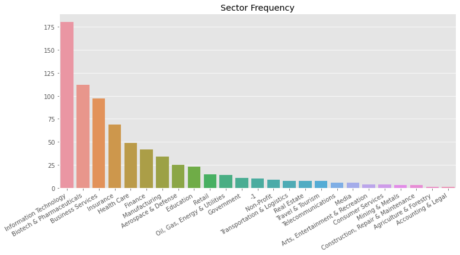
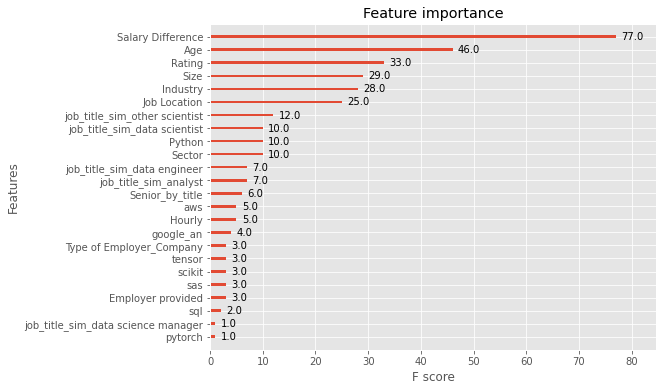
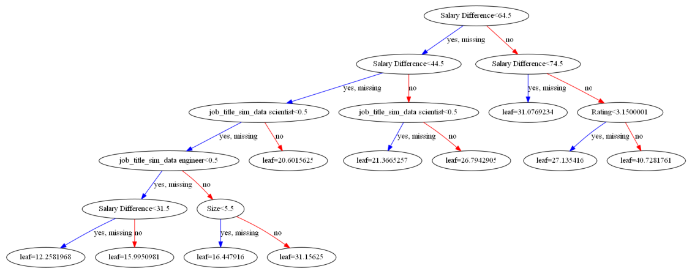

# Data Science Salary Prediction: Project Overview

* (Basic Description)
* Cleaning/engineering
* Models used?
* Cross Validation?
* Results?

## Code and Resources Used

**Programming Language:** Python  
**Packages:** pandas, numpy, matplotlib, seaborn, statsmodels, scikit-learn, xgboost, graphviz  
**Dataset Source:** https://www.kaggle.com/datasets/nikhilbhathi/data-scientist-salary-us-glassdoor  

## Data Cleaning

The dataset contained many redundant and impractical variables which had to be dropped or transformed. There were also many missing data points that had to be dealt with via imputation or dropping variables with too much missing data.

## EDA

I looked at the distributions of the data and the value counts for the various categorical variables. Below is a highlight of the distribution of which sectors data scientists in this sample works in.

## Model Building

Feature engineering.  

I trained three different models and for performance evaluation I used three different metrics: Mean Squared Error, Root Mean Squared Error and Mean Absolute Error. 

I tried three different models:
* **XGBoosted Decision Tree Regression** -   
* **Multiple Linear Regression** - A comparative baseline.  
* **Lasso Regression** -   

Cross-validation.  

Details of XGBoost.  

## Model Performance

The XGBoosted Decision Tree Regression model was the best performer by far no matter the metric used.

* **XGBoosted Decision Tree Regression:** RMSE =  
* **Multiple Linear Regression:** RMSE =  
* **Lasso Regression:** RMSE =     
